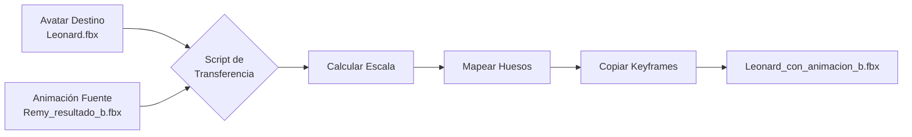

# 🎬 Scripts de Transferencia de Animación FBX

Este directorio contiene scripts para transferir animaciones de un avatar a otro.

## 📦 Archivos

| Archivo | Descripción | Requiere Blender |
|---------|-------------|------------------|
| `transferir_a_leonard.bat` | Ejecuta la transferencia Leonard + Remy_b | ✅ Sí |
| `transferir_animacion_a_leonard.py` | Script Blender específico para Leonard | ✅ Sí |
| `transferir_animacion_generica.py` | Script genérico Python + Blender | ✅ Sí |
| `README_TRANSFERIR_ANIMACION.md` | Documentación completa | No |

## 🚀 Inicio Rápido

### ¿Tienes Blender instalado?

**SÍ:** Usa el script `.bat`:
```bash
transferir_a_leonard.bat
```

**NO:** Descarga Blender primero:
- Windows: https://www.blender.org/download/
- Instala en la ruta por defecto: `C:\Program Files\Blender Foundation\`

### Uso Manual

```bash
# Con argumentos explícitos
python transferir_animacion_generica.py avatars/Leonard.fbx deploy-viewer-temp/output/Remy_resultado_b.fbx output/Leonard_b.fbx

# Sin argumentos (usa valores por defecto)
python transferir_animacion_generica.py
```

## ⚙️ Cómo Funciona



1. **Carga** ambos FBX
2. **Calcula escala** automática (compara alturas)
3. **Mapea huesos** (busca coincidencias de nombres)
4. **Copia keyframes** con ajuste de escala
5. **Exporta** resultado

## 📊 Comparación de Métodos

### Método 1: Blender Python (Recomendado)
✅ Preciso y confiable  
✅ Maneja cualquier tipo de FBX  
✅ Ajuste automático de escala  
❌ Requiere Blender instalado  

### Método 2: Edición Manual en Blender
✅ Control total  
✅ Visual e interactivo  
❌ Lento y manual  
❌ Difícil de automatizar  

## 🎯 Casos de Uso

```bash
# Transferir animación B a Leonard
python transferir_animacion_generica.py avatars/Leonard.fbx deploy-viewer-temp/output/Remy_resultado_b.fbx

# Transferir animación C a JH
python transferir_animacion_generica.py avatars/JH.fbx deploy-viewer-temp/output/Remy_resultado_c.fbx output/JH_c.fbx

# Transferir animación de JH a Remy
python transferir_animacion_generica.py avatars/Remy.fbx deploy-viewer-temp/output/JH_resultado_b.fbx
```

## 🐛 Problemas Comunes

### "No se encontró Blender"
**Solución:** Instala Blender desde https://www.blender.org/download/

### "No se encontró el armature"
**Solución:** Verifica que el FBX tenga un esqueleto:
1. Abre el FBX en Blender
2. Busca un objeto tipo "Armature" en el outliner

### La animación se ve deformada
**Solución:** Los esqueletos son muy diferentes. Usa avatares con estructura similar.

## 📚 Documentación Completa

Lee `README_TRANSFERIR_ANIMACION.md` para:
- Instrucciones detalladas
- Parámetros técnicos
- Solución de problemas completa
- Ejemplos avanzados

## ✨ Resultado Esperado

**Entrada:**
- `avatars/Leonard.fbx` (avatar con piel)
- `deploy-viewer-temp/output/Remy_resultado_b.fbx` (animación)

**Salida:**
- `output/Leonard_con_animacion_b.fbx` (Leonard animado)

**Contenido del FBX resultante:**
- Mesh de Leonard (piel, texturas)
- Esqueleto de Leonard
- Animación de Remy transferida
- Escala ajustada automáticamente

## 🔗 Referencias

- [Blender Python API](https://docs.blender.org/api/current/)
- [FBX Format Specs](https://code.blender.org/2013/08/fbx-binary-file-format-specification/)
